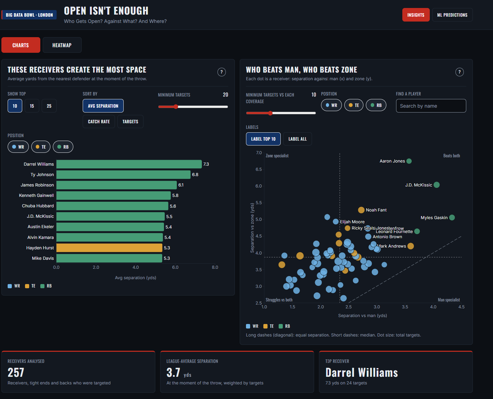
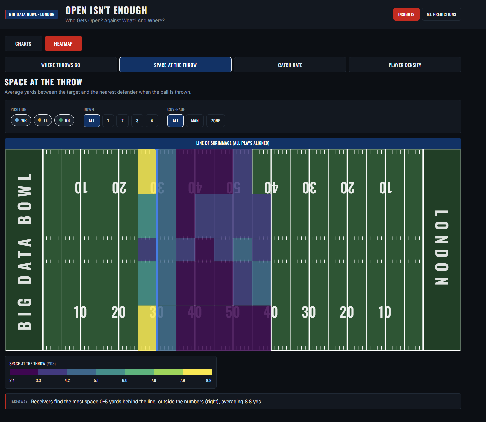
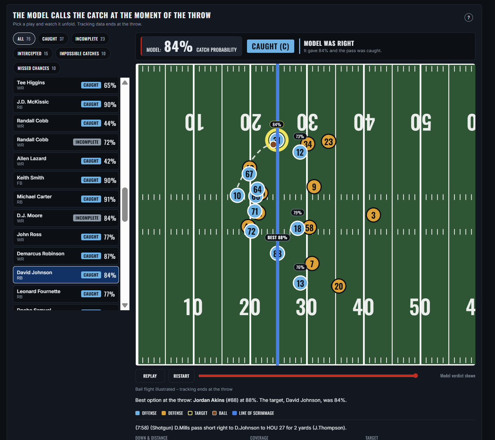
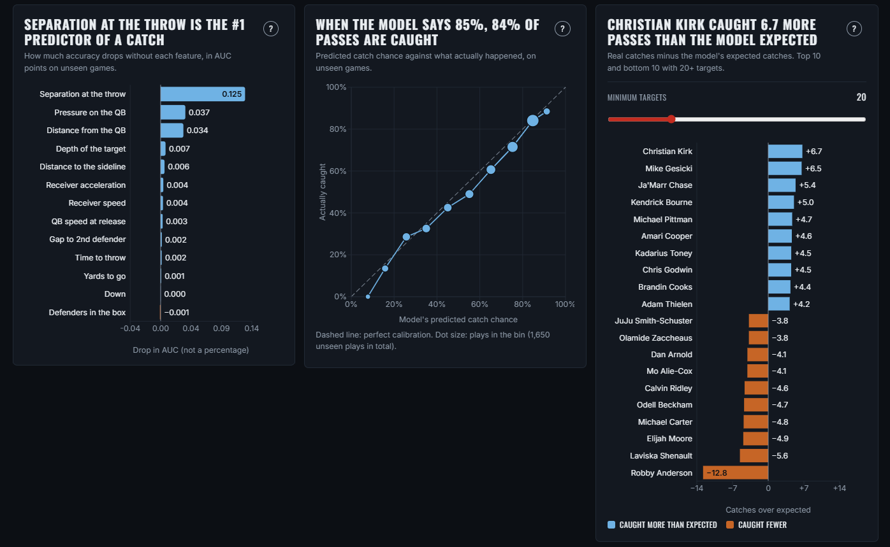

# Rakhymbek Bekarys and Yousuf Sayed

**Note added later: WE WON!**

**Insight.** Using NFL Next Gen Stats tracking for 7,251 targeted passes (2021, Weeks 1–8), we measured how much space each receiver has at the exact moment the ball is thrown, and built a catch-probability model using only what the QB could see at that moment. Separation at the throw is by far the strongest predictor of a catch: removing it costs the model 3× more accuracy than any other feature, and catch rate rises from [X]% when a defender is within 1 yard to [Y]% with 5+ yards of space. Trained on Weeks 1–6 and tested on unseen Weeks 7–8, the model reaches AUC 0.76 (vs 0.50 baseline, 71.5% accuracy) and is well calibrated. Comparing actual vs expected catches reveals which receivers win contested balls ([top COE names]), and which QBs pass up the safest open target.

## What's inside
- **Insights page:** Separation leaderboard and man vs zone scatter (who beats which coverage). You can filter according to ranking, catch rate, targets, and position. You can hover over points to get tooltips of more information. Summary stats are given below, stating the receivers analysed and the top receiver from the data.
- **Interactive Heatmap:** An interactive heatmap which shows throw locations, separation, catch rate, and player density. With various filtering options with a key and summary at the bottom.
- **ML Predictions page:** Play simulator that replays real plays from snap to throw, shows the model's catch probability and every receiver's odds, then reveals the result (Caught / Incomplete / Intercepted). The animation can be paused and replayed and two charts demonstrate the key takeaways from the model. The ML training results are displayed for transparency.

## Method
- Target receiver parsed from the play description (95% match rate); all features measured at the throw frame, with no post-throw data.
- Features: separation to nearest/2nd defender, depth, sideline distance, QB distance, pass-rush pressure, receiver speed, time to throw, down & distance, coverage.
- Models: logistic regression, random forest, gradient boosting; 5-fold GroupKFold by game for selection; held-out Weeks 7–8 for the final score.
- Note: ball flight in the simulator is illustrated, because tracking ends at the throw.

## Run it
- Frontend (no backend needed): `cd frontend && npm install && npm run dev`
- Backend (optional, needs the dataset in `backend/nfl-big-data-bowl-regional-event-data-main/`): `cd backend && pip install pandas numpy scikit-learn fastapi uvicorn joblib && python run_all.py && python -m insights.heatmap`

Built with Python, scikit-learn, React, Recharts and Kiro at the NFL Big Data Bowl London regional event.

